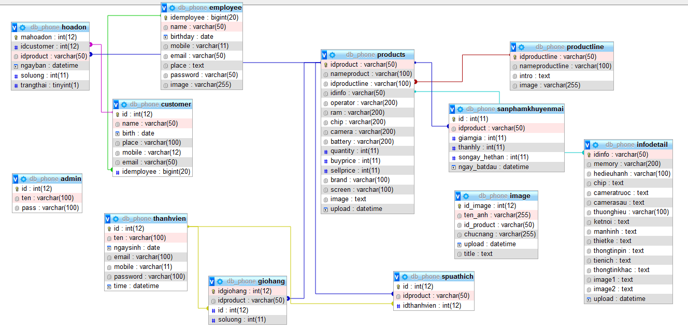

# csdl2020-v3
Đề tài : Website bán điện thoại di động online

link website pc demo : https://csdl-2020.000webhostapp.com

username : pqthinh0@gmail.com | password: 123 <thành viên>

username : admin | admin <quản trị viên>

link git: https://github.com/pqthinh/csdl2020-phpsql-v2 

Ngôn ngữ sd : 

php html css js

Quản lý file dùng git . IDE netbean 8.0.2 . push commit = gitdesktop

CSDL: phpMyAdmin ( xampp ) / truy vấn sd mysqli+php

Chức năng : 
+Trong phần hiển thị thông tin người dùng không hiển thị hóa đơn hiện tại

+Show sản phẩm bán chạy / ưa thích / sp mới nhất / sp có khuyến mãi / sp hàng vn / theo danh mục sp

+Tìm kiếm sản phẩm + hiển thị quảng cáo phù hợp với kết quả tìm kiếm

+Giỏ hàng / thêm sp vào giỏ / sửa số lượng sp trong giỏ / xóa sp khỏi giỏ hàng

+Chức năng thanh toán :
  (lấy thông tin thành viên -> thông tin trên bảng khách hàng)
  (lấy thông tin từ bảng giỏ hàng chèn vào bảng hóa đơn )
  (làm rỗng giỏ hàng khi đã thanh toán)
  
+Đăng nhập quyền admin/ thành viên . Đăng ký thành viên mới

+Danh mục quản trị viên : 
-Quản lý ds nhân viên
-Quản lý hóa đơn (trạng thái đơn hàng)
-Quản lý danh mục sp ( thêm sửa xóa sp / sp khuyến mãi)
-Tính toán doanh thu :(không làm nữa :|)

Mô hình csdl:

1: Bảng sản phẩm :

2: Bảng thông tin chi tiết sản phẩm

3: Bảng dòng sản phẩm 

4: Bảng khách hàng

5: Bảng nhân viên

6: Bảng hóa đơn

7: Bảng ảnh

8: Bảng sản phẩm khuyến mãi

9: Bảng thành viên

10:Giỏ hàng

11: Admin (lưu thông tin người quản trị hệ thống / danh mục quản trị)

Mô hình liên kết bảng :
 

Truy vấn cơ bản sử dụng trong bài .

+Lấy thông tin sản phẩm :

+Lấy thông tin sp đang có khuyến mãi :

+Sản phẩm nổi bật / mới nhất / bán chạy nhất

+Lọc sản phẩm :

+Tìm kiếm sp theo tên

+Insert dữ liệu vào bảng

+Update dữ liệu

+Xóa dữ liệu

+Lấy thông tin từ giỏ hàng

+Lấy thông tin hóa đơn 

...

 

 end

