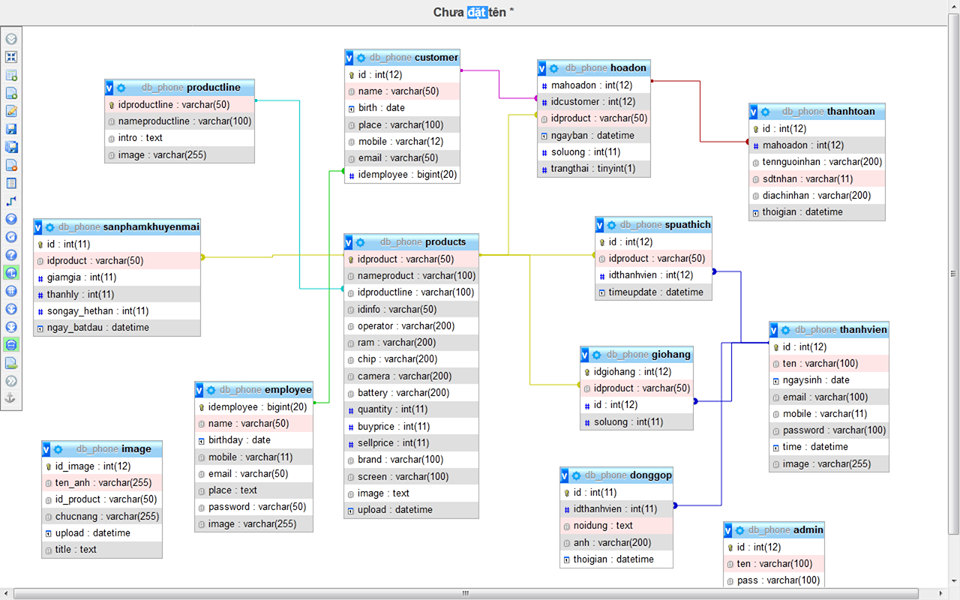

# csdl2020-v5 _ web điện thoại _ php
Đề tài : Website bán điện thoại di động online

shorturl.at/eprK9 (LINK gg docx)
(Chức năng chi tiết + truy vấn cơ bản + Chi tiết các bảng trong csdl )

<ul>
  
1 Giới thiệu : 

  <li>
Link git :  https://github.com/pqthinh/csdl2020-v3
</li>
  <li>
Link web demo: https://csdl-2020.000webhostapp.com
</li>
( Đăng nhập :  pqthinh0@gmail.com | 123  hoặc admin| admin) 
<li>
  <ul> Công nghệ sử dụng: 
    <li>Mô hình web:  client - server </li>
    <li>html css js (thuần) : code front-end </li>
    <li>php (thuần) + mysql  : code back-end</li>
    <li>Quản lý project : github / git-desktop</li>
    <li>IDE code : netbeans 8.2</li>
    <li>Database : phpMyAdmin (xampp)</li>
  </ul>
</li>
<li> 
  <ul> Trang web tham khảo :
      <li>https://www.w3schools.com  (html/ css / js  / php) </li>
      <li>https://www.mysql.com  (mysql)</li>
  </ul>
  </li>
</ul>

  
2 Chức năng :  
+Trong phần hiển thị thông tin người dùng không hiển thị hóa đơn hiện tại

+Show sản phẩm bán chạy / ưa thích / sp mới nhất / sp có khuyến mãi / sp hàng vn / theo danh mục sp

+Tìm kiếm sản phẩm + hiển thị quảng cáo phù hợp với kết quả tìm kiếm

+Giỏ hàng / thêm sp vào giỏ / sửa số lượng sp trong giỏ / xóa sp khỏi giỏ hàng

+Chức năng thanh toán :
  (lấy thông tin thành viên -> thông tin trên bảng khách hàng)
  (lấy thông tin từ bảng giỏ hàng chèn vào bảng hóa đơn )
  (làm rỗng giỏ hàng khi đã thanh toán)
  
+Đăng nhập quyền admin/ thành viên . Đăng ký thành viên mới

+Danh mục quản trị viên : 
-Quản lý ds nhân viên
-Quản lý hóa đơn (trạng thái đơn hàng)
-Quản lý danh mục sp ( thêm sửa xóa sp / sp khuyến mãi)
-Tính toán doanh thu :(không có)
-Quản lý lỗi do người dùng báo cáo về hệ thống

3 Mô hình csdl:
 
Mô hình liên kết bảng :
 

4 Truy vấn cơ bản sử dụng trong bài .

+Lấy thông tin sản phẩm :

+Lấy thông tin sp đang có khuyến mãi :

+Sản phẩm nổi bật / mới nhất / bán chạy nhất

+Lọc sản phẩm :

+Tìm kiếm sp theo tên

+Insert dữ liệu vào bảng

+Update dữ liệu

+Xóa dữ liệu

+Lấy thông tin từ giỏ hàng

+Lấy thông tin hóa đơn 

...

 

end

--------------------Kết thúc ngày 18/5/2020--------------------------

